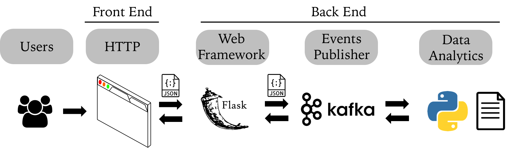
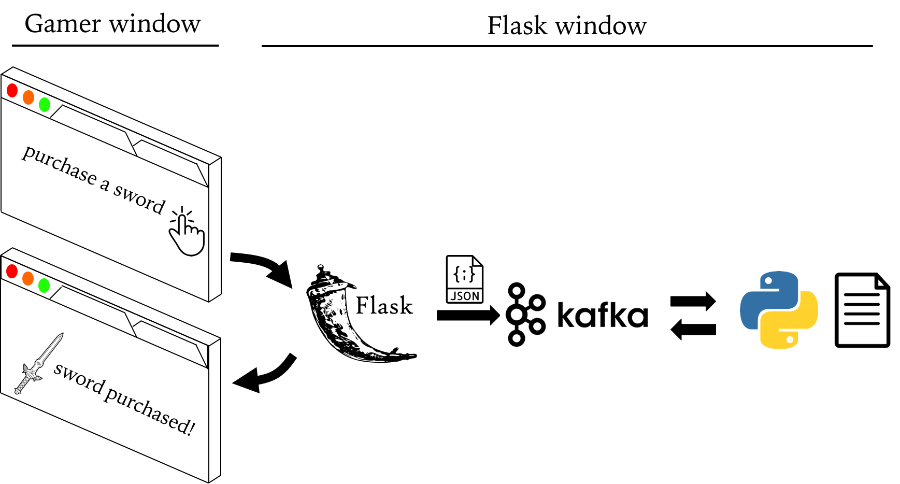

|Title |  Kafka deployment in Web-based Mobile Game |
|-----------|----------------------------------|
|Author | Kenneth Chen |
|Utility | Flask, Kafka, Spark, HDFS, Droplet, Docker |
|Date | 7/1/2018 |

__Synopsis__  

We are now building a pipeline for smooth communications between web gamers. Intuitively, internet users communicate via sending and receiving messages (data packets) across the web. The protocol that facilitates data transfer is HTTP with its conventional GET, POST method. Adding on top of the HTTP for reliable data transfer is TCP protocol (more advanced algorithm such as TCP Reno). Here we are mainly concerned with our customers' gaming activity and their web-based communication to our game servers. We will use Flask, a small web framework that will do all the jobs in the background for us to send and receive web-based messages generated by kafka. A data flow chart was shown below.   

<p align="center">
</p>
<p align="center">Figure 1. Data transfer in web-based communication</p>

__Procedure__  

In mobile game community, web-based communication is a crucial part of the game development in which players response (events) to game play must be instantly updated in order for players to enjoy playing a game without any glitch. We deployed **Flask** for our web-based mobile game called **"Build a Nation"** and used **Kafka** to manage gamer web activities such as "purchase a sword", "purchase a horse", "purchase a shield" etc etc etc. 

I laid out a step by step implementation of Flask and Kafka in details as follows.  

## In Droplet, Update images 
### 1. Updating Docker Images 
```
docker pull midsw205/base:0.1.8
docker pull confluentinc/cp-zookeeper:latest
docker pull confluentinc/cp-kafka:latest
```
### 2. Logging into the assignment folder
```
cd w205/assignment-09-kckenneth/
```

### 3. Checking what's in my directory 
```
ls  
```

### 4. Making sure at which branch I am on git
```
git branch   
```
### 5. Checking if there's any pre-existing docker containers running
```
docker-compose ps  
docker ps -a  
```

##### if need be, remove any running containers by rm
```
docker rm -f $(docker ps -aq) 
```
### 6. Run a single docker container midsw205 in bash mode
```
docker run -it --rm -v /home/science/w205:/w205 midsw205/base:latest bash
```
## Inside the Docker Container
1. check into assignment 9 folder,
2. check git branch, create assignment branch if necessary  
3. create docker-compose.yml with 3 containers
  - zookeeper  
  - kafka  
  - mids  
4. create game_app.py

```
cd assignment-09-kckenneth  
ls  
git status  
git branch 
git checkout -b assignment  
vi docker-compose.yml  
vi game_app.py
exit  
```

## Flask game_app.py in details  
```
#!/usr/bin/env python
from kafka import KafkaProducer
from flask import Flask
app = Flask(__name__)
event_logger = KafkaProducer(bootstrap_servers='kafka:29092')
events_topic = 'events'

@app.route("/")
def default_response():
    event_logger.send(events_topic, 'default'.encode())
    return "\nThis is the default response!\n"

@app.route("/purchase_a_sword")
def purchase_sword():
    # business logic to purchase sword
    # log event to kafka
    event_logger.send(events_topic, 'purchased_sword'.encode())
    return "\nSword Purchased!\n"
```
 
Here we are using game_app.py to call flask module to run. Any messages or events that game players generate from the web such as "purchase a sword", "purchase a horse", "upgrade the arrow", etc etc etc will be fed into Kafka. Therefore we import the **KafkaProducer** library in our game_app.py script. Kafka will then publish those events in json format. In the frontend, we can enrich our web page with more **CSS** features for gamer experiences. But in this exercise, we will only execute a simple message. In the backend, those messages will be stored and analyzed in our game server (**Data Analytics**). For example, "purchase a sword" events will be stored with its game player ID in our game server. Any game activities that a game player can now pursue or execute because of the possession of a sword will be relayed from the backend game server to the front end so that the player could now execute additional activity in the game due to the possession of the sword.  

#### One of the flask app methods, purchase_sword(), to remind myself
```
@app.route("/purchase_a_sword")                                   # gamer input "purchase_a_sword" after the slash /
def purchase_sword():
    event_logger.send(events_topic, 'purchased_sword'.encode())   # "purchase_a_sword" event will be recorded as "purchased_sword" in Kafka. It will be published instantly and consumed at the backend 
    return "\nSword Purchased!\n"                                 # gamer received "Sword Purchased!" screen display
```

## In Droplet, I spin up the cluster in detached mode by -d
```
docker-compose up -d
```
### Check if the zookeeper is up and running by finding the *binding* word in the logs file
```
docker-compose logs zookeeper | grep -i binding  
```
### I also checked kafka is up and running by searching the word *started*
```
docker-compose logs kafka | grep -i started
```
## I. Kafka 1st step -- Create a Topic
#### I created a topic *events* with partition 1, replication-factor 1
```
docker-compose exec kafka kafka-topics --create --topic events --partitions 1 --replication-factor 1 --if-not-exists --zookeeper zookeeper:32181
```
#### I checked the broker I just created by *describe* function  
```
docker-compose exec kafka kafka-topics --describe --topic events --zookeeper zookeeper:32181
```  
## II. Kafka 2nd step -- Produce Messages 
#### Kafka messages will be from gamers web activities. Since there are two ends in this exercise, we need to open two CLI windows. 

<p align="center">
</p>
<p align="center">Figure 2. Kafka and Flask in Game activity management</p>

- Gamer window  
- Flask window  

There are two processes.  
1) We first run the flask in flask window in order to initiate a web-based application such as **"Build A Nation"** game in this case.  
2) A gamer will execute game activites on the web browser. Here "purchase a sword" action will be executed. We will therefore execute from the gamer CLI window. 

### 1) Run python flask in Flask Window
```
docker-compose exec mids env FLASK_APP=/w205/assignment-09-kckenneth/game_api.py flask run
```
### 2) Gamer Activity in Gamer Window 

##### You need to ssh into Droplet from another CLI window. Once you're in the Droplet, go to /w205/assignment-09-kckenneth/ folder
```
docker-compose exec mids curl http://localhost:5000/purchase_a_sword
docker-compose exec mids curl http://localhost:5000/purchase_a_sword
docker-compose exec mids curl http://localhost:5000/
docker-compose exec mids curl http://localhost:5000/purchase_a_sword
```

## III. Kafka 3rd step -- Consume Game Events or Messages
- 1) We consume Kafka message at the backend. So it's supposed to be in another CLI window unless we want to stop the Flask app.  
- 2) We can also consume Kafka message in Gamer CLI window. However, in reality, gamer CLI window wouldn't have the docker cluster at all. Remember that it's for the convenience.  
```
docker-compose exec mids bash -c "kafkacat -C -b kafka:29092 -t events -o beginning -e"
```
#### 4 messages are consumed  
```
purchased_sword
purchased_sword
default
purchased_sword
% Reached end of topic events [0] at offset 4: exiting
```

## Exit
```
docker-compose down
```
# Summary
In the following weeks, more advanced data analyatics will be explored. 
