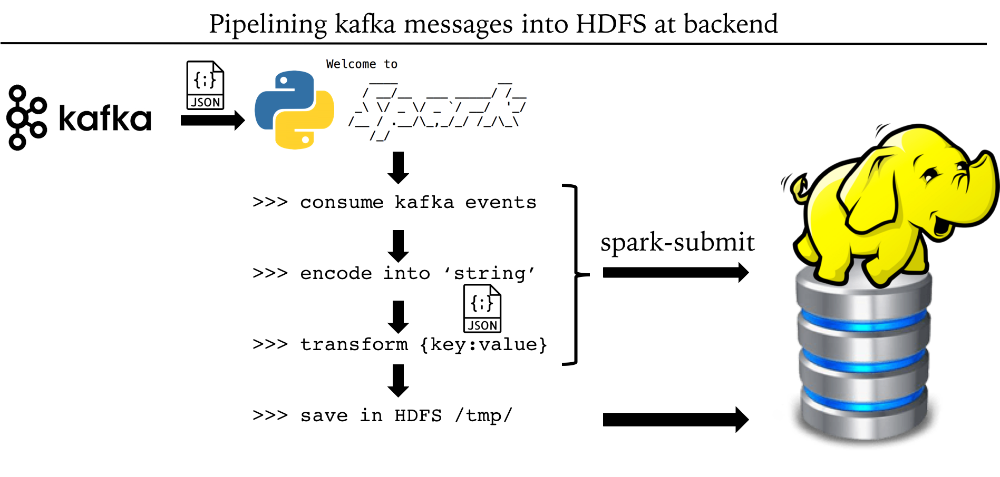

|Title |  Kafka deployment in Web-based Mobile Game |
|-----------|----------------------------------|
|Author | Kenneth Chen |
|Utility | Flask, Kafka, Spark, HDFS, Droplet, Docker |
|Date | 7/1/2018 |

__Synopsis__  

We are now building a pipeline for smooth communications between web gamers. Intuitively, internet users communicate via sending and receiving messages (data packets) across the web. The protocol that facilitates data transfer is HTTP with its conventional GET, POST method. Adding on top of the HTTP for reliable data transfer is TCP protocol (more advanced algorithm such as TCP Reno). Here we are mainly concerned with our customers' gaming activity and their web-based communication to our game servers. We will use Flask, a small web framework that will do all the jobs in the background for us to send and receive web-based messages generated by kafka. In addition, all the gamer activities or events will be relayed to our backend server by kafka and stored in our hadoop file system. A data flow chart was shown below.   

<p align="center">
</p>
<p align="center">Figure 1. Data transfer in web-based communication</p>

__Procedure__  

In mobile game community, web-based communication is a crucial part of the game development in which players response (events) to game play must be instantly updated in order for players to enjoy playing a game without any glitch. We deployed **Flask** for our web-based mobile game called **"Build a Nation"** and used **Kafka** to manage gamer web activities such as "purchase a sword", "purchase a horse", "purchase a shield" etc etc etc. 

I laid out a step by step implementation of Flask and Kafka in details as follows.  

## In Droplet, Update images 
### 1. Updating Docker Images 
```
docker pull midsw205/base:0.1.8
docker pull confluentinc/cp-zookeeper:latest
docker pull confluentinc/cp-kafka:latest
docker pull midsw205/spark-python:0.0.5
docker pull midsw205/cdh-minimal:latest
```
#### Images description 
- midsw205/base [python, jupyter apps]  
- confluentinc/cp-zookeeper [zookeeper manager for kafka]  
- confluentinc/cp-kafka [kafka app]  
- midsw205/spark-python [spark]  
- midsw205/cdh-minimal [cloudera hadoop]  

### 2. Logging into the assignment folder
```
cd w205/assignment-12-kckenneth/
```

### 3. Checking what's in my directory 
```
ls  
```

### 4. Making sure at which branch I am on git
```
git branch   
```
### 5. Checking if there's any pre-existing docker containers running
```
docker-compose ps  
docker ps -a  
```

##### if need be, remove any running containers by rm
```
docker rm -f $(docker ps -aq) 
```
### 6. Run a single docker container midsw205 in bash mode
```
docker run -it --rm -v /home/science/w205:/w205 midsw205/base:latest bash
```
## Inside the Docker Container
1. check into assignment 12 folder,
2. check git branch, create assignment branch if necessary  
3. create docker-compose.yml with 5 containers
  - zookeeper  
  - kafka  
  - mids  
  - spark
  - cloudera 
4. create the following python scripts.  
  - game_api.py (for flask)
  - filtered_writes.py (extract, transform, filter kafka messages and save in HDFS) 
  
```
cd assignment-12-kckenneth  
ls  
git status  
git branch 
git checkout -b assignment  
vi docker-compose.yml  
vi game_api.py
vi filtered_writes.py
exit  
```

## Python script for our Flask and Spark 
Since there are python scripts, I separated python scripts in another annotation for clear walk-through and detailed explanation. 

- game_api.py
- filtered_writes.py

https://github.com/kckenneth/flask_kafka/blob/master/python_script.md

## In Droplet, I spin up the cluster in detached mode by -d
```
docker-compose up -d
```
### Check if the zookeeper is up and running by finding the *binding* word in the logs file
```
docker-compose logs zookeeper | grep -i binding  
```
### I also checked kafka is up and running by searching the word *started*
```
docker-compose logs kafka | grep -i started
```
### Check if the cloudera is up and running by searching the word *hadoop* in the logs file
```
docker-compose logs cloudera | grep -i hadoop
```
### Check if the HDFS has any existing files 
```
docker-compose exec cloudera hadoop fs -ls /tmp/
```
You should have two files: yarn and hive
```
drwxrwxrwt   - mapred mapred              0 2018-02-06 18:27 /tmp/hadoop-yarn
drwx-wx-wx   - root   supergroup          0 2018-07-23 03:21 /tmp/hive
```

## I. Kafka 1st step -- Create a Topic
#### I created a topic *events* with partition 1, replication-factor 1
```
docker-compose exec kafka kafka-topics --create --topic events --partitions 1 --replication-factor 1 --if-not-exists --zookeeper zookeeper:32181
```
#### I checked the broker I just created by *describe* function  
```
docker-compose exec kafka kafka-topics --describe --topic events --zookeeper zookeeper:32181
```  
## II. Kafka 2nd step -- Produce Messages 
#### Kafka messages will be from gamers web activities. Since there are two ends in this exercise, we need to open two CLI windows. 

<p align="center">
</p>
<p align="center">Figure 2. Kafka and Flask in Game activity management</p>

- Gamer window  
- Flask window  

There are two processes.  
1) We first run the flask in flask window in order to initiate a web-based application such as **"Build A Nation"** game in this case.  
2) A gamer will execute game activites on the web browser. Here "purchase a sword" action will be executed. We will therefore execute from the gamer CLI window. 

### 1) Run python flask in Flask Window
```
docker-compose exec mids env FLASK_APP=/w205/assignment-12-kckenneth/game_api.py flask run --host 0.0.0.0
```
### 2) Gamer Activity in Gamer Window 

##### You need to ssh into Droplet from another CLI window. Once you're in the Droplet, go to /w205/assignment-12-kckenneth/ folder
We're using Apache Bench (ab) that allows us to replicate the messages. Since we have a few more game features, we will produce them in multiple. 
```
docker-compose exec mids ab -n 10 -H "Host: user1.comcast.com" http://localhost:5000/
docker-compose exec mids ab -n 10 -H "Host: user1.comcast.com" http://localhost:5000/purchase_a_sword
docker-compose exec mids ab -n 7 -H "Host: user2.att.com" http://localhost:5000/
docker-compose exec mids ab -n 15 -H "Host: user2.att.com" http://localhost:5000/purchase_a_shield
docker-compose exec mids ab -n 15 -H "Host: user3.verizon.com" http://localhost:5000/purchase_a_sword
docker-compose exec mids ab -n 5 -H "Host: user3.verizon.com" http://localhost:5000/upgrade_a_sword
docker-compose exec mids ab -n 5 -H "Host: user1.comcast.com" http://localhost:5000/upgrade_a_sword
docker-compose exec mids ab -n 7 -H "Host: user2.att.com" http://localhost:5000/upgrade_a_shield
docker-compose exec mids ab -n 20 -H "Host: user4.spectrum.com" http://localhost:5000/purchase_a_knife
docker-compose exec mids ab -n 20 -H "Host: user4.spectrum.com" http://localhost:5000/
docker-compose exec mids ab -n 14 -H "Host: user5.fios.com" http://localhost:5000/purchase_a_shield
```

## III. Kafka 3rd step -- Consume Game Events or Messages
- 1) We consume Kafka message at the backend. So it's supposed to be in another CLI window unless we want to stop the Flask app.  
- 2) We can also consume Kafka message in Gamer CLI window. However, in reality, gamer CLI window wouldn't have the docker cluster at all. Remember that it's for the convenience.  

# spark-submit 
### Pipelining kafka messages into HDFS
We have analyzed our subscribed messages in pyspark environment so far. We could also pipeline our subscribed messages directly to HDFS by developing several python scripts that will automatically extract and transform messages into digestible information and save them in HDFS.  

<p align="center">
</p>
<p align="center">Figure 3. Streamline of kafka messages into HDFS</p>

## I. Extract, Transform, Filter, Save events (filtered_writes.py)

We used two pipeline scripts: one for extract and transform kafka messages and the other for filtering only the gamer activity such as "purchase_sword" and saving them into HDFS. 
```
docker-compose exec spark spark-submit /w205/assignment-12-kckenneth/extract_events.py
docker-compose exec spark spark-submit /w205/assignment-12-kckenneth/transform_events.py
docker-compose exec spark spark-submit /w205/assignment-12-kckenneth/filtered_writes.py
```
#### Checking in HDFS if our script automatically extract messages and save 
```
docker-compose exec cloudera hadoop fs -ls /tmp/
```
If our script is successful, we should see `extracted_events` and `purchases` file
```
Found 4 items
drwxr-xr-x   - root   supergroup          0 2018-07-23 15:45 /tmp/extracted_events
drwxrwxrwt   - mapred mapred              0 2018-02-06 18:27 /tmp/hadoop-yarn
drwx-wx-wx   - root   supergroup          0 2018-07-23 15:04 /tmp/hive
drwxr-xr-x   - root   supergroup          0 2018-07-23 15:16 /tmp/purchases
```
We further checked `extracted_events` file
```
Found 2 items
-rw-r--r--   1 root supergroup          0 2018-07-23 17:04 /tmp/extracted_events/_SUCCESS
-rw-r--r--   1 root supergroup       1381 2018-07-23 17:04 /tmp/extracted_events/part-00000-19067b0f-d9bb-49bd-912a-bb08b2135e85-c000.snappy.parquet
```
We also checked `purchases` file
```
docker-compose exec cloudera hadoop fs -ls /tmp/purchases
```
If our extracted events are successfully saved in HDFS, we should see SUCCESS file and associated main file.  AS we could run parallel processing in HDFS, every node will generate two files (1) SUCCESS and (2) saved file. Since we're running on one node, we see two files. 
```
Found 2 items
-rw-r--r--   1 root supergroup          0 2018-07-23 17:06 /tmp/purchases/_SUCCESS
-rw-r--r--   1 root supergroup       1684 2018-07-23 17:06 /tmp/purchases/part-00000-100a8ca2-a4c0-41bd-b3ac-3b45aac8815d-c000.snappy.parquet
```

As we have run a python script that extracted, transformed extracted messages, filtered and overwrote them in HDFS, it's a good habit to check if our files are properly saved (Sanity check). So we load files from HDFS and check the extracted messages. We first opened another CLI window and ssh into droplet. Once we're in the droplet, go to /w205/assignment-12-kckenneth/ and run spark. 
```
docker-compose exec spark pyspark
```
In spark environment, we load the files saved in HDFS
```
>>> my_extracted_events = sqlContext.read.parquet('/tmp/extracted_events')
>>> my_extracted_events.printSchema()
root
 |-- Accept: string (nullable = true)
 |-- Host: string (nullable = true)
 |-- User-Agent: string (nullable = true)
 |-- event_type: string (nullable = true)

>>> my_extracted_events.show(10, False)
+------+-----------------+---------------+----------+
|Accept|Host             |User-Agent     |event_type|
+------+-----------------+---------------+----------+
|*/*   |user1.comcast.com|ApacheBench/2.3|default   |
|*/*   |user1.comcast.com|ApacheBench/2.3|default   |
|*/*   |user1.comcast.com|ApacheBench/2.3|default   |
|*/*   |user1.comcast.com|ApacheBench/2.3|default   |
|*/*   |user1.comcast.com|ApacheBench/2.3|default   |
|*/*   |user1.comcast.com|ApacheBench/2.3|default   |
|*/*   |user1.comcast.com|ApacheBench/2.3|default   |
|*/*   |user1.comcast.com|ApacheBench/2.3|default   |
|*/*   |user1.comcast.com|ApacheBench/2.3|default   |
|*/*   |user1.comcast.com|ApacheBench/2.3|default   |
+------+-----------------+---------------+----------+
only showing top 10 rows
```
We see that our extracted events are properly transformed into several keys and saved in HDFS


# Gamer Activities Analytics in Spark

After loading our saved files, I analyzed gamer activities in spark sql environment. I first registered the table extracted in json format into `gamer` table. I then counted the number of unique activities that gamers pursued and listed them. 

```
>>> my_extracted_events.registerTempTable('gamer')
>>> spark.sql("SELECT COUNT(*) FROM gamer").show()
+--------+
|count(1)|
+--------+
|     128|
+--------+

>>> spark.sql("SELECT event_type, COUNT(event_type) as event_count FROM gamer GROUP BY event_type ORDER BY event_count DESC").show()
+---------------+-----------+                                                   
|     event_type|event_count|
+---------------+-----------+
|        default|         37|
|purchase_shield|         29|
| purchase_sword|         25|
| purchase_knife|         20|
|  upgrade_sword|         10|
| upgrade_shield|          7|
+---------------+-----------+

>>> spark.sql("SELECT Host, COUNT(*) as number_of_player FROM gamer GROUP BY Host ORDER BY number_of_player DESC").show()
+------------------+----------------+                                           
|              Host|number_of_player|
+------------------+----------------+
|user4.spectrum.com|              40|
|     user2.att.com|              29|
| user1.comcast.com|              25|
| user3.verizon.com|              20|
|    user5.fios.com|              14|
+------------------+----------------+
```
We found that there are total of 128 gamer activites. Majority of them are just 'default' playing. The 2nd most activity gamer pursue is "purchasing shield" 29 times. We also checked how many players from our web-based game. There are total of 5 players, and a player from `spectrum` host plays the most. 

# Running Spark in Jupyter Notebook

We can also run Spark in Jupyter Notebook. To do so, we call spark in Jupyter environment
```
docker-compose exec spark env PYSPARK_DRIVER_PYTHON=jupyter PYSPARK_DRIVER_PYTHON_OPTS='notebook --no-browser --port 8888 --ip 0.0.0.0 --allow-root' pyspark
```

In another CLI window, we create a symbolic link for our mounted directory to spark environment
```
ln -s /w205 w205
exit
```

In Jupyter Notebook, we can continue with our kafka message analytics as usual. 

I created a juypter notebook `extract_events.ipynb`.


## Exit
```
docker-compose down
```
# Summary
We developed our game **Build A Nation** with more game features such as 
- purchase a sword
- purchase a shield  
- upgrade a sword  
- upgrade a shield 

We launched our web-based game with micro webservice app in Python, `Flask`. Any gamer activities are recorded in `Kafka` and relayed to our server. We then consumed gamer activities or events in our backend. We wrote our script to produce more detailed events such as 
- Accept  
- Host  
- User-Agent  
- event_type  
- timestamp 
we have more information on gamer activities. We also pipelined our web-based game communications to HDFS by employing spark-submit function in our container. By running a pre-designed `extract_events.py` and `transform_events.py`, we developed a pipeline that digest gamers events in real time, feed them into our backend by kafka and save messages in HDFS. 

Our game analytics shows an insight into which player plays the game most often and what activity a player pursue the most during the game. We observed that a player from `spectrum` host plays the most. Majority of players purchased shield. 

We learned how to set up docker-compose.yml and include containers as necessary. We also launched our web-based game by flask app implementation. We also consume any activities gamer pursue in our web based game by kafka. We employed accurate recording of the gamer activities such as their host, timestamp, activities such as purchase a sword, upgrade a sword, etc etc. We saved our kafka messages relayed from frontend to our backend in HDFS. Data analysis was mainly done in spark step by step. In the end, we developed a pipeline that streamline kafka messages from the frontend directly to our datawarehouse such as HDFS and save them in parquet format. By doing so, we were able to analyze the progress of our game, player engagement with our products and what kinds of activities players enjoy playing in the game. 
