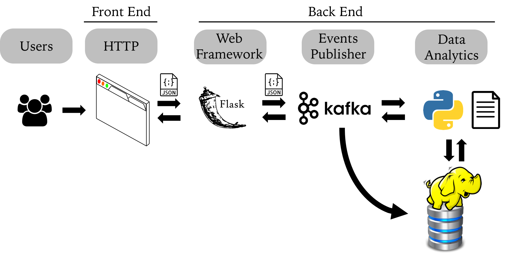
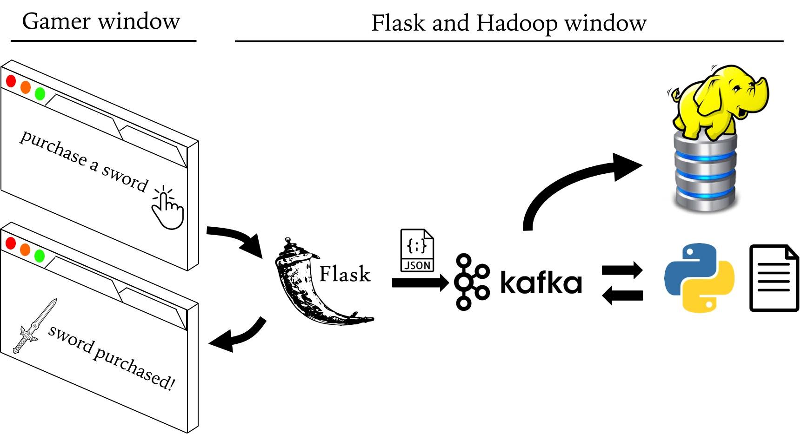

|Title |  Kafka deployment in Web-based Mobile Game |
|-----------|----------------------------------|
|Author | Kenneth Chen |
|Utility | Flask, Kafka, Spark, HDFS, Droplet, Docker |
|Date | 7/1/2018 |

__Synopsis__  

We are now building a pipeline for smooth communications between web gamers. Intuitively, internet users communicate via sending and receiving messages (data packets) across the web. The protocol that facilitates data transfer is HTTP with its conventional GET, POST method. Adding on top of the HTTP for reliable data transfer is TCP protocol (more advanced algorithm such as TCP Reno). Here we are mainly concerned with our customers' gaming activity and their web-based communication to our game servers. We will use Flask, a small web framework that will do all the jobs in the background for us to send and receive web-based messages generated by kafka. In addition, all the gamer activities or events will be relayed to our backend server by kafka and stored in our hadoop file system. A data flow chart was shown below.   

<p align="center">
</p>
<p align="center">Figure 1. Data transfer in web-based communication</p>

__Procedure__  

In mobile game community, web-based communication is a crucial part of the game development in which players response (events) to game play must be instantly updated in order for players to enjoy playing a game without any glitch. We deployed **Flask** for our web-based mobile game called **"Build a Nation"** and used **Kafka** to manage gamer web activities such as "purchase a sword", "purchase a horse", "purchase a shield" etc etc etc. 

I laid out a step by step implementation of Flask and Kafka in details as follows.  

## In Droplet, Update images 
### 1. Updating Docker Images 
```
docker pull midsw205/base:0.1.8
docker pull confluentinc/cp-zookeeper:latest
docker pull confluentinc/cp-kafka:latest
docker pull midsw205/spark-python:0.0.5
docker pull midsw205/cdh-minimal:latest
```
#### Images description 
- midsw205/base [python, jupyter apps]  
- confluentinc/cp-zookeeper [zookeeper manager for kafka]  
- confluentinc/cp-kafka [kafka app]  
- midsw205/spark-python [spark]  
- midsw205/cdh-minimal [cloudera hadoop]  

### 2. Logging into the assignment folder
```
cd w205/assignment-11-kckenneth/
```

### 3. Checking what's in my directory 
```
ls  
```

### 4. Making sure at which branch I am on git
```
git branch   
```
### 5. Checking if there's any pre-existing docker containers running
```
docker-compose ps  
docker ps -a  
```

##### if need be, remove any running containers by rm
```
docker rm -f $(docker ps -aq) 
```
### 6. Run a single docker container midsw205 in bash mode
```
docker run -it --rm -v /home/science/w205:/w205 midsw205/base:latest bash
```
## Inside the Docker Container
1. check into assignment 11 folder,
2. check git branch, create assignment branch if necessary  
3. create docker-compose.yml with 5 containers
  - zookeeper  
  - kafka  
  - mids  
  - spark
  - cloudera 
4. create 4 python scripts: (1) game_api.py, (2) extract_events.py, (3) transform_events.py, (4) separate_events.py

```
cd assignment-11-kckenneth  
ls  
git status  
git branch 
git checkout -b assignment  
vi docker-compose.yml  
vi game_api.py
exit  
```

## Python script for our Flask and Spark 
Since there are 4 python scripts, I separated python script in another annotation for clear walk-through and detailed explanation. 

- game_api.py
- extract_events.py
- transform_events.py
- separate_events.py

https://github.com/kckenneth/flask_kafka/blob/master/python_script.md

## In Droplet, I spin up the cluster in detached mode by -d
```
docker-compose up -d
```
### Check if the zookeeper is up and running by finding the *binding* word in the logs file
```
docker-compose logs zookeeper | grep -i binding  
```
### I also checked kafka is up and running by searching the word *started*
```
docker-compose logs kafka | grep -i started
```
### Check if the cloudera is up and running by searching the word *hadoop* in the logs file
```
docker-compose logs cloudera | grep -i hadoop
```
### Check the Hadoop has any existing files 
```
docker-compose exec cloudera hadoop fs -ls /tmp/
```

## I. Kafka 1st step -- Create a Topic
#### I created a topic *events* with partition 1, replication-factor 1
```
docker-compose exec kafka kafka-topics --create --topic events --partitions 1 --replication-factor 1 --if-not-exists --zookeeper zookeeper:32181
```
#### I checked the broker I just created by *describe* function  
```
docker-compose exec kafka kafka-topics --describe --topic events --zookeeper zookeeper:32181
```  
## II. Kafka 2nd step -- Produce Messages 
#### Kafka messages will be from gamers web activities. Since there are two ends in this exercise, we need to open two CLI windows. 

<p align="center">
</p>
<p align="center">Figure 2. Kafka and Flask in Game activity management</p>

- Gamer window  
- Flask window  

There are two processes.  
1) We first run the flask in flask window in order to initiate a web-based application such as **"Build A Nation"** game in this case.  
2) A gamer will execute game activites on the web browser. Here "purchase a sword" action will be executed. We will therefore execute from the gamer CLI window. 

### 1) Run python flask in Flask Window
```
docker-compose exec mids env FLASK_APP=/w205/assignment-11-kckenneth/game_api.py flask run --host 0.0.0.0
```
### 2) Gamer Activity in Gamer Window 

##### You need to ssh into Droplet from another CLI window. Once you're in the Droplet, go to /w205/assignment-10-kckenneth/ folder
```
docker-compose exec mids curl http://localhost:5000/purchase_a_sword
docker-compose exec mids curl http://localhost:5000/purchase_a_sword
docker-compose exec mids curl http://localhost:5000/
docker-compose exec mids curl http://localhost:5000/purchase_a_sword
docker-compose exec mids curl http://localhost:5000/purchase_a_shield
docker-compose exec mids curl http://localhost:5000/upgrade_a_sword
docker-compose exec mids curl http://localhost:5000/purchase_a_shield
docker-compose exec mids curl http://localhost:5000/upgrade_a_shield
docker-compose exec mids curl http://localhost:5000/
docker-compose exec mids curl http://localhost:5000/purchase_a_shield
```

## III. Kafka 3rd step -- Consume Game Events or Messages
- 1) We consume Kafka message at the backend. So it's supposed to be in another CLI window unless we want to stop the Flask app.  
- 2) We can also consume Kafka message in Gamer CLI window. However, in reality, gamer CLI window wouldn't have the docker cluster at all. Remember that it's for the convenience.  

### Consume game events or messages in `mids` container
```
docker-compose exec mids bash -c "kafkacat -C -b kafka:29092 -t events -o beginning -e"
```
#### 10 messages are consumed  
```
{"Host": "localhost:5000", "event_type": "purchase_sword", "Accept": "*/*", "User-Agent": "curl/7.47.0"}
{"Host": "localhost:5000", "event_type": "purchase_sword", "Accept": "*/*", "User-Agent": "curl/7.47.0"}
{"Host": "localhost:5000", "event_type": "default", "Accept": "*/*", "User-Agent": "curl/7.47.0"}
{"Host": "localhost:5000", "event_type": "purchase_sword", "Accept": "*/*", "User-Agent": "curl/7.47.0"}
{"Host": "localhost:5000", "event_type": "purchase_shield", "Accept": "*/*", "User-Agent": "curl/7.47.0"}
{"Host": "localhost:5000", "event_type": "upgrade_shield", "Accept": "*/*", "User-Agent": "curl/7.47.0"}
{"Host": "localhost:5000", "event_type": "upgrade_sword", "Accept": "*/*", "User-Agent": "curl/7.47.0"}
{"Host": "localhost:5000", "event_type": "purchase_shield", "Accept": "*/*", "User-Agent": "curl/7.47.0"}
{"Host": "localhost:5000", "event_type": "default", "Accept": "*/*", "User-Agent": "curl/7.47.0"}
{"Host": "localhost:5000", "event_type": "purchase_shield", "Accept": "*/*", "User-Agent": "curl/7.47.0"}
% Reached end of topic events [0] at offset 10: exiting
```

### Consume game events in `pyspark` container
1. We first launch the `pyspark` container  
```
docker-compose exec spark pyspark
```
2. We then consume the events or messages in spark  
```
>>> raw_events = spark.read.format("kafka").option("kafka.bootstrap.servers", "kafka:29092").option("subscribe","events").option("startingOffsets", "earliest").option("endingOffsets", "latest").load() 
>>> raw_events.cache()
>>> raw_events.show()
+----+--------------------+------+---------+------+--------------------+-------------+
| key|               value| topic|partition|offset|           timestamp|timestampType|
+----+--------------------+------+---------+------+--------------------+-------------+
|null|[7B 22 48 6F 73 7...|events|        0|     0|2018-07-22 21:42:...|            0|
|null|[7B 22 48 6F 73 7...|events|        0|     1|2018-07-22 21:42:...|            0|
|null|[7B 22 48 6F 73 7...|events|        0|     2|2018-07-22 21:42:...|            0|
|null|[7B 22 48 6F 73 7...|events|        0|     3|2018-07-22 21:42:...|            0|
|null|[7B 22 48 6F 73 7...|events|        0|     4|2018-07-22 21:42:...|            0|
|null|[7B 22 48 6F 73 7...|events|        0|     5|2018-07-22 21:42:...|            0|
|null|[7B 22 48 6F 73 7...|events|        0|     6|2018-07-22 21:43:...|            0|
|null|[7B 22 48 6F 73 7...|events|        0|     7|2018-07-22 21:43:...|            0|
|null|[7B 22 48 6F 73 7...|events|        0|     8|2018-07-22 21:43:...|            0|
|null|[7B 22 48 6F 73 7...|events|        0|     9|2018-07-22 21:43:...|            0|
+----+--------------------+------+---------+------+--------------------+-------------+
```
Since the events we just consumed are binary format in spark (written in scala programming language), we transformed our data into `string` format in pyspark. 

```
>>> events = raw_events.select(raw_events.value.cast('string'))
>>> events.printSchema()
root
 |-- value: string (nullable = true)

>>> events.show(20, False)

+---------------------------------------------------------------------------------------------------------+
|value                                                                                                    |
+---------------------------------------------------------------------------------------------------------+
|{"Host": "localhost:5000", "event_type": "purchase_sword", "Accept": "*/*", "User-Agent": "curl/7.47.0"} |
|{"Host": "localhost:5000", "event_type": "purchase_sword", "Accept": "*/*", "User-Agent": "curl/7.47.0"} |
|{"Host": "localhost:5000", "event_type": "default", "Accept": "*/*", "User-Agent": "curl/7.47.0"}        |
|{"Host": "localhost:5000", "event_type": "purchase_sword", "Accept": "*/*", "User-Agent": "curl/7.47.0"} |
|{"Host": "localhost:5000", "event_type": "purchase_shield", "Accept": "*/*", "User-Agent": "curl/7.47.0"}|
|{"Host": "localhost:5000", "event_type": "upgrade_shield", "Accept": "*/*", "User-Agent": "curl/7.47.0"} |
|{"Host": "localhost:5000", "event_type": "upgrade_sword", "Accept": "*/*", "User-Agent": "curl/7.47.0"}  |
|{"Host": "localhost:5000", "event_type": "purchase_shield", "Accept": "*/*", "User-Agent": "curl/7.47.0"}|
|{"Host": "localhost:5000", "event_type": "default", "Accept": "*/*", "User-Agent": "curl/7.47.0"}        |
|{"Host": "localhost:5000", "event_type": "purchase_shield", "Accept": "*/*", "User-Agent": "curl/7.47.0"}|
+---------------------------------------------------------------------------------------------------------+
```

3. Since the kafka messages are in json format, we will load the messages into json format in pyspark  
```
>>> import json
>>> extracted_events = events.rdd.map(lambda x: json.loads(x.value)).toDF()
>>> extracted_events.printSchema()
root
 |-- Accept: string (nullable = true)
 |-- Host: string (nullable = true)
 |-- User-Agent: string (nullable = true)
 |-- event_type: string (nullable = true)
 
>>> extracted_events.show()
+------+--------------+-----------+---------------+
|Accept|Host          |User-Agent |event_type     |
+------+--------------+-----------+---------------+
|*/*   |localhost:5000|curl/7.47.0|purchase_sword |
|*/*   |localhost:5000|curl/7.47.0|purchase_sword |
|*/*   |localhost:5000|curl/7.47.0|default        |
|*/*   |localhost:5000|curl/7.47.0|purchase_sword |
|*/*   |localhost:5000|curl/7.47.0|purchase_shield|
|*/*   |localhost:5000|curl/7.47.0|upgrade_shield |
|*/*   |localhost:5000|curl/7.47.0|upgrade_sword  |
|*/*   |localhost:5000|curl/7.47.0|purchase_shield|
|*/*   |localhost:5000|curl/7.47.0|default        |
|*/*   |localhost:5000|curl/7.47.0|purchase_shield|
+------+--------------+-----------+---------------+
```

# Gamer Activities Analytics in Spark

As a preliminary, I analyzed gamer activities in spark sql environment. I first registered the table extracted in json format into `gamer` table. I then counted the number of unique activities that gamers pursued and listed them. 

```
>>> extracted_events.registerTempTable('gamer')
>>> spark.sql("SELECT event_type, COUNT(event_type) as event_count FROM gamer GROUP BY event_type ORDER BY event_count DESC").show()
+---------------+-----------+                                                   
|     event_type|event_count|
+---------------+-----------+
|purchase_shield|          3|
| purchase_sword|          3|
|        default|          2|
| upgrade_shield|          1|
|  upgrade_sword|          1|
+---------------+-----------+
```
We found that there are more activities on `purchase_sword` and `purchase_shield` and upgrading activities are as few as one user per activity. 

# spark-submit 
We have analyzed our subscribed messages in pyspark environment so far. We could also pipeline our subscribed messages directly to HDFS by developing several python scripts that will automatically extract and transform messages into digestible information and save them in HDFS.  

## I. Extracting events
```
docker-compose exec spark spark-submit /w205/assignment-11-kckenneth/extract_events.py
```
#### Checking in HDFS if our script automatically extract messages and save 
```
docker-compose exec cloudera hadoop fs -ls /tmp/
docker-compose exec cloudera hadoop fs -ls /tmp/extracted_events/
```
## II. Transforming events
```
docker-compose exec spark spark-submit /w205/assignment-11-kckenneth/transform_events.py
```
As we have run a python script that transformed extracted messages and overwrote them in HDFS, it's a MUST to check if our files are properly saved. So we load files from HDFS and check the extracted messages. We first opened another CLI window and ssh into droplet. Once we're in the droplet, go to /w205/assignment-11-kckenneth/ and run spark. 
```
docker-compose exec spark pyspark
```
In spark environment, we load the files saved in HDFS
```
my_extracted_events = sqlContext.read.parquet('/tmp/extracted_events')
my_extracted_events.show()


```

## III. Separating events
```
docker-compose exec spark spark-submit /w205/assignment-11-kckenneth/separate_events.py
```

## Exit
```
docker-compose down
```
# Summary
We developed our game **Build A Nation** with more game features such as 
- purchase a sword
- purchase a shield  
- upgrade a sword  
- upgrade a shield 

We launched our web-based game with micro webservice app in Python, `Flask`. Any gamer activities are recorded in `Kafka` and relayed to our server. We then consumed gamer activities or events in our backend. We wrote our script to produce more detailed events such as 
- Accept  
- Host  
- User-Agent  
- event_type  
we have more information on gamer activities. Since event messages were coded in json format, we consumed them pyspark and analyzed player activites. In the following week, we will develop more game features and data analytics. 
